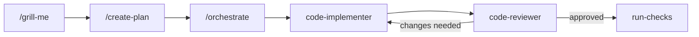

# agent-skills

**One set of skills, agents and instructions for Claude Code, Codex and OpenCode.**


Everything lives here once and is symlinked into each platform, so an edit is
live in the next session everywhere. Skills use the open
[Agent Skills](https://agentskills.io) format: each is a folder containing a
`SKILL.md`, which a platform loads when a task matches it or when you invoke it.

## Quick start

```sh
git clone https://github.com/tobywise/agent-skills.git
cd agent-skills
bash scripts/install.sh               # add --with-policy for the always-on rules
```

Restart each platform afterwards. Re-run the installer after a `git pull` or
after adding or removing anything. It only creates, updates or prunes its own
symlinks, plus one import line in `~/.claude/CLAUDE.md` with `--with-policy`.

Needs `bash` and `git`, plus `node` for `langsmith-review`. On macOS, install
GNU `findutils` and a current `bash`.

## Skills

Invoke a skill as `/name` in Claude Code and OpenCode, or ask for it by name in
Codex. Agents also load skills themselves when a task matches.

| Plan and build | |
|---|---|
| `grill-me` | Interview you about a design until it's pinned down |
| `create-plan` | Write an implementation-ready plan, or a revised copy of one |
| `create-multiple-plans` | Split large work into ordered, independently useful plans |
| `orchestrate` | Carry a plan through implement → review → verify from the main session |
| `implement-direct` | Implement a plan with the smallest correct change, running nothing |
| `run-checks` | Run tests and builds locally, or on remote workers where they exist |

| Review | |
|---|---|
| `review-implementation` | Read-only review of the current work against its plan |
| `scientific-risk-review` | Second opinion on whether a finding should really block |
| `pr-description` | Reviewer-focused PR description with a call-dependency diagram |

| Scientific work | |
|---|---|
| `scientific-analysis` | Rules for proportionate single-use analyses that fail loudly |
| `create-scientific-rework-plan` | Audit a scientific codebase and plan a simpler rework |
| `prototype` | One quick, exploratory analysis without production ceremony |

| Other | |
|---|---|
| `planning` | The shared plan format the other plan skills use |
| `slide-deck` | A navigable HTML slide deck explaining a topic |
| `langsmith-review`, `debrief` | Inspect or debrief agent runs from LangSmith traces* |

<sub>* These need [LangSmith](https://smith.langchain.com) tracing of OpenCode or
Paseo sessions and `LANGSMITH_API_KEY`. Delete them if you don't use that.</sub>

### A typical workflow



Each step also works on its own: implement a plan with `/implement-direct`, or
review one with `/review-implementation`.

## Agents

Agents have their own model and permissions, so you can delegate to them. Each
is a thin wrapper that loads one skill.

| Agent | Runs | Access |
|---|---|---|
| `code-implementer` | `implement-direct` | Edits code, runs nothing |
| `code-reviewer` | `review-implementation` | Read-only (on Claude Code it keeps a shell for `git diff`) |
| `scientific-risk-reviewer` | `scientific-risk-review` | Read-only, no shell |
| `code-prototype` | `prototype` | Unrestricted. It asks you questions, so start it as the session (`claude --agent code-prototype`, or `/prototype` in OpenCode) rather than delegating to it. There's no Codex version; use the skill there. |

## Always-on policy (optional)

`--with-policy` installs [`policy/execution-policy.md`](policy/execution-policy.md)
as every platform's global instructions. It covers PR descriptions, Python
conventions, a strict fail-fast rule for scientific computations, and when work
counts as complete. `scientific-analysis` relies on its fail-fast rule.

It's opt-in because it's one person's working rules. The installer won't
overwrite an existing global `AGENTS.md`; for Claude Code it adds one import
line to `~/.claude/CLAUDE.md` and leaves the rest alone.

## Where checks run

`run-checks` works out how to run tests and builds on each machine, so there's
nothing to configure:

1. If the project's `AGENTS.md` or `CLAUDE.md` names a runner, it uses that.
2. Otherwise, if `cbrun` is on `PATH`, it sends checks to remote
   [Crabbox](https://github.com/openclaw/crabbox) workers using
   [`references/crabbox.md`](skills/run-checks/references/crabbox.md).
3. Otherwise it runs them locally in the project's locked environment
   (`uv run --locked`, `make`, …).

To keep one repository local on a Crabbox machine, add this line to its
`AGENTS.md` or `CLAUDE.md`:

```md
Checks in this repository run locally, even where Crabbox is available.
```

## How it's wired

```
skills/<name>/SKILL.md        →  ~/.agents/skills (Codex, OpenCode) and ~/.claude/skills/<name>
agents/<name>/claude.md       →  ~/.claude/agents/<name>.md
agents/<name>/opencode.md     →  ~/.config/opencode/agents/<name>.md
agents/<name>/codex.toml      →  ~/.codex/agents/<name>.toml
commands/opencode/<name>.md   →  ~/.config/opencode/commands/<name>.md
policy/execution-policy.md    →  each platform's global instructions (--with-policy)
```

> [!NOTE]
> Everything is a symlink into this checkout, so **switching branches switches
> what every platform runs**.

Override install locations with `AGENTS_HOME`, `CLAUDE_HOME`, `CODEX_HOME` or
`OPENCODE_HOME`.

## Adding your own

- **Skill:** create `skills/<name>/SKILL.md` with `name` and `description`
  frontmatter, and re-run the installer. Write the description as a trigger
  ("Use when…"), because that's what platforms match tasks against. Refer to
  bundled files as `~/.agents/skills/<name>/…`, not by a platform-specific
  variable.
- **OpenCode command:** add `commands/opencode/<name>.md` whose body loads the
  skill. Claude Code and Codex need nothing extra.
- **Agent:** put its instructions in a skill, then add `agents/<name>/` with
  a file for each platform you want. Copy an existing agent as a template.

> [!WARNING]
> In agent frontmatter, a `description` containing `: ` (colon, space) breaks
> the YAML and the agent silently fails to load. Reword it or quote it.

To remove something, delete its directory and re-run the installer.

<details>
<summary><strong>Check that it loaded</strong></summary>

A symlink existing doesn't prove the platform loaded it. Check with the
platform itself:

| | Skills | Agents |
|---|---|---|
| Claude Code | listed at session start | `claude --agent x -p hi` errors with the list |
| Codex | `codex debug prompt-input` | ask which agent types `spawn_agent` accepts |
| OpenCode | `opencode debug skill` | `opencode debug config` |

For the policy, `codex debug prompt-input` shows it; on Claude Code and
OpenCode, ask the agent to quote a line of it.

</details>

<details>
<summary><strong>Troubleshooting</strong></summary>

- **A skill is ignored in OpenCode.** A same-named copy in
  `~/.config/opencode/skills` wins over the shared one. `opencode debug skill`
  shows which file loaded; delete the local copy.
- **A skill appears twice.** An older copied install is still in another
  scanned directory, such as `~/.codex/skills` or `~/.claude/skills`. Remove
  the copy.
- **Something doesn't appear.** Restart the platform, then check the link
  resolves (`ls -lL ~/.agents/skills/<name>/SKILL.md`) and the frontmatter
  parses.
- **The installer refuses a path.** A real file is in the way; move it aside
  and re-run.

</details>

<details>
<summary><strong>Uninstall</strong></summary>

```sh
rm ~/.agents/skills
for l in ~/.claude/skills/* ~/.claude/agents/* ~/.codex/agents/* \
         ~/.config/opencode/agents/* ~/.config/opencode/commands/* \
         ~/.codex/AGENTS.md ~/.config/opencode/AGENTS.md; do
  [ -L "$l" ] && case "$(readlink "$l")" in */agent-skills/*) rm "$l";; esac
done
```

If you used `--with-policy`, also delete the `@…/execution-policy.md` line from
`~/.claude/CLAUDE.md`.

</details>

## Licence

MIT — see [`LICENSE`](LICENSE).
